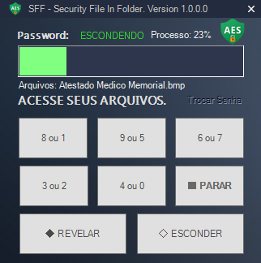

# SSF - Secure File In Folder  - Segurança e Privacidade em Primeiro Lugar!
Criptografa e Descriptografa arquivos dentro da pasta que esta alocada. Muito bom para evitar roubos de arquivos. 
Advertências: Não utilize o Programa dentro de pastas de Sistemas Tipo "\Windows" ou "\System32" Pois ele pode criptografar aquivos de Sistemas e corromper o Sistema por inteiro. 
Modo de Uso: Utilize ele dentro da pasta onde estão seu arquivos que você quer proteger, ele irá criptografar e Descriptografar tudo dentro da pasta e Sub Pastas.   
Bom Uso e Proveito!

